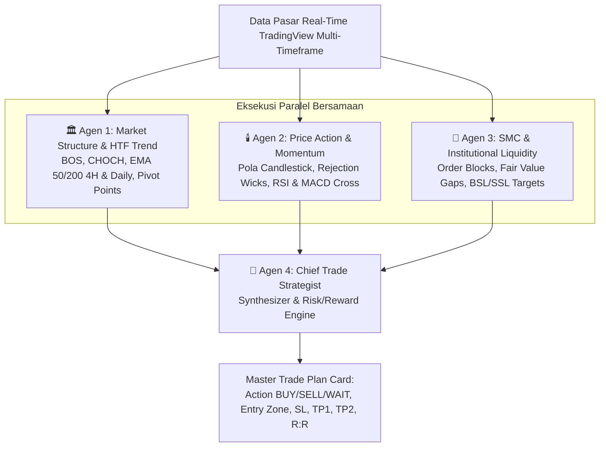

# 🪙 Forex & Gold (XAUUSD) AI Live Trading Terminal


Aplikasi terminal trading modern dengan antarmuka bertema gelap (*Dark Bloomberg Style*), chart bergerak real-time resmi dari TradingView, dan mesin analisis AI **4 Agen Paralel** untuk Forex dan Emas (XAUUSD).

---

## ✨ Fitur Utama

- **📈 Real-Time Moving Chart (TradingView Advanced):**
  - Streaming data tick-by-tick dari OANDA / FOREXCOM.
  - Multi-Timeframe switcher instan: `1m`, `5m`, `15m`, `1H`, `4H`, `1D`.
  - Dilengkapi drawing tools, indikator teknikal bawaan, dan volume.
- **⚡ Analisis AI Multi-Agen Paralel:**
  - **🏛️ Agen 1 (Market Structure & HTF Trend):** Menganalisis tren 4H & Daily, keselarasan HTF, Break of Structure (BOS), dan Pivot Point institusional.
  - **🕯️ Agen 2 (Price Action & Momentum):** Membaca pola candlestick (Pin Bar, Engulfing, Doji), status RSI, dan akselerasi momentum MACD.
  - **🌊 Agen 3 (SMC & Institutional Liquidity):** Evaluasi valuasi *Discount vs Premium*, pemetaan *Order Block* (OB), dan target likuiditas (BSL/SSL).
  - **🎯 Agen 4 (Chief Trade Strategist):** Mensintesis seluruh agen menjadi rencana trading actionable: Rekomendasi (`BUY`/`SELL`/`WAIT`), *Confidence Score*, *Entry Zone*, *Stop Loss*, *Take Profit 1 & 2*, dan kalkulasi rasio *Risk:Reward (R:R)*.
- **📊 Real-Time Metric Ribbon:**
  - Meteran dinamis RSI (14), status persilangan MACD, pita EMA 20/50/200, dan rentang Pivot S1/R1.
- **🌐 Dukungan Multi-Pasangan Mata Uang:**
  - `XAUUSD` (Gold Spot)
  - `EURUSD`
  - `GBPUSD`
  - `USDJPY`
  - `BTCUSD`

---

## 🏛️ Arsitektur Multi-Agen Paralel



---

## 🚀 Panduan Instalasi & Menjalankan

### 1. Kloning Repository
```bash
git clone https://github.com/USERNAME_KAMU/gold-ai-terminal.git
cd gold-ai-terminal
```

### 2. Pasang Dependencies
Pastikan Python 3.10+ sudah terpasang, lalu jalankan:
```bash
pip install -r requirements.txt
```

### 3. Jalankan Aplikasi
* **Cara Cepat (Windows):** Cukup double-click file `run_terminal.bat`.
* **Cara Manual:**
```bash
python server.py
```
Buka browser di: **`http://localhost:5000`**

---

## 📁 Struktur Berkas

```
gold_ai_terminal/
├── agents/
│   ├── market_structure.py    # Agen 1: Struktur Tren HTF & Pivot S/R
│   ├── price_action.py        # Agen 2: Pola Candlestick & Momentum
│   ├── smc_liquidity.py       # Agen 3: Smart Money Concepts & Liquidity
│   └── trade_strategist.py    # Agen 4: Chief Synthesizer & R:R Engine
├── templates/
│   └── index.html             # Antarmuka Terminal Trading
├── static/
│   ├── app.js                 # Logika Frontend & Controller Widget TV
│   └── style.css              # Dark Bloomberg Terminal Style
├── data_fetcher.py            # Konektor Data Multi-Timeframe TradingView
├── server.py                  # Flask Web Server & API
├── requirements.txt           # Daftar Pustaka Python
├── run_terminal.bat           # Launcher Cepat Windows
├── .gitignore
└── README.md
```

---

## ⚠️ Disclaimer
*Aplikasi ini dibuat untuk tujuan riset, edukasi, dan analisis teknikal pasar finansial. Segala keputusan trading dan pengelolaan risiko sepenuhnya merupakan tanggung jawab pengguna masing-masing.*
